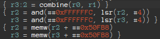

# Hexagonal - Reverse

## Challenge description

```
De retour dans l'Hexagone suite à mes congés, je m'interroge sur cet équipement surprenant trouvé dans les contreforts du Fagradalsfjall.

Il semble tenter d'afficher une image sur un écran, mais l'affichage est extrêmement lent.

Pouvez-vous m'aider ?
```

The challenge is shipped with the file `mynd`.

## Hexagone sans règles

```sh
$ file mynd
mynd: ELF 32-bit LSB executable, QUALCOMM DSP6, version 1 (SYSV), statically linked, not stripped
```

As `file` told us, the executable is a 32-bit ELF built for a mysterious CPU
named QUALCOMM DSP6. The Qualcomm DSP6 (for 6th gen Digital Signal Processor) is
a family of processors used in smartphones, cars and several mobile devices.

The QDSP6 is also known as Hexagon, hence the name of the challenge. The
processor possess thirty-two 32-bit GPR (`r0-r31`) which can also be accessed
as 64-bit registers pairs (e.g. `r3:r2`). The program's code and data is
stored in a 32-bit address space. It seems pretty classic.

However the Hexagon architecture has one surprise: it implements multithreading
directly on the hardware. It is possible to group up to 4 instructions in a
"packet" and execute them in parallel. More on this feature later.


After getting some intel (pun intended) on the Hexagon architecture we can now
dig into the challenge.

My first reaction was to try to run the program. QEMU provides the possibility
to run Hexagon binaries which you can get in the package `qemu-arch-extra` on
ArchLinux for exemple:
```sh
$ qemu-hexagon ./mynd
qemu-hexagon: ./mynd: Error mapping file: Invalid argument
```

Unfortunately it didn't work. I tried with the Hexagon simulator given by
Qualcomm but it didn't work either. Let's do it statically then.

## Reversing the binary

The program seems to contain a lot of functions as it is statically linked but
fortunately, it isn't stripped. We can quickly reduce the area to explore to
only two functions: `main` and `getpixel`.

Let's start by the `main` function:


The first bit creates the stack frame for the function and calls `scanf`:


The call to `scanf` is equivalent to `scanf("%d %d", &i, &j)`. We can easily
guess that this is the way to input the coordinates of a pixel.

Maybe you've noticed the instructions grouped inside brackets. This is the
"packets" I've described earlier. These packets answers to some rules. For
example all instructions in a packet starts by reading their source registers in
parallel, then all executes at the same time and finishes by writing to their
destination registers. It means that you cannot set a register and use its new
value in the same packet, unless...

Take this packet:
```
{ r0 = add(sp, #0x10+j)
  r2 = add(sp, #0x10+i)
  memw(sp + #0x10+j_addr) = r0.new }
```
By using the `.new` it is possible to assign a value to `r0` in the first line
and then use it in the third. This packet loads the addresses of `i` and `j`
into `r0` and `r2` and then stores `j` address (in `r0` register) inside the
`j_addr` variable. `mem` is the instruction used to move values inside memory
using a suffix to specify the size, `memw` moves a 32-bit integer.

Now that we have the basis of the instruction set, let's move on.



`r3:r2 = combine(r0, r1)` moves `i` and `j` inside a 64-bit register pair but as
the pair will never be used again it is just a way to do `r3 = r0; r2 = r1` in
only one instruction.
```
{ r2 = and(##0xFFFFFFC, lsr(r2, #4))
  r3 = and(##0xFFFFFFC, lsr(r3, #4)) }
```
is equivalent to a division by 64 which gives an index into an array.

At `0x50FB8` the array is: `[5, 1, 4, 7, 0, 2, 6, 3]`. The image is in fact
split into multiple blocks which are swapped. This array allows to put the
blocks back into the correct order.


The `Rd = insert(Rs, #width, #off)` instructions copies width bits from the
least significant part of Rs into Rd shifting them by off. For example with
`r0 = insert(r3, #0x1A, #6)`, the 26 last bits of `r3` will be shifted by 6 and
put into `r0`. The high part of the registers will be filled with the index of
the block retrieved from the array and the low part will be the index of the
pixel into this block. Then the program will call the `getpixel` function.


On the end of the function, the result of `getpixel` is used to get three values
which are added. We can guess it's the red, green and blue values of the pixel
as the result will be checked againts `0xc7` in order to determine if the pixel
is set or not, very much like a binarization of the image.

## Pixel perfect

Let's dig into the `getpixel` function:


The beginning of the function concatenates the coordinates of the pixel into one
register: `r0 += asl(r1, #9)` (`asl` is arithmethic shift left).


The `r2` register is used to iterate over the buffer. The buffer containing the
image is stored at address `0xC428`. Once one value is retrieved, it is XORed
with `0x55`.

The next conditions are used to determine which will be the value of `r2` for
the next iteration:


If the value inside `data[r2]` (data being the buffer storing the image inside
`.data` section) is positive, the next value of `r2` will be
`r2 + data[r2] * 3 + 1` else it will be `r2 + 4`. It must be some kind of
compression algorithm of images but I'm not very familiar with this.
The choice is done with the `mux` (multiplexer) instruction
which outputs one or another register depending of the condition checked.

Finally, `r3` adds all the values that we retrieve during the loop and if the
results is bigger than the pixel position, we exit the function.


Otherwise, if `r2` gets too far we break the loop. The return value is the
position of the pixel inside the buffer.

## Checkered flag

We understood more or less how the program works. We give the position of a
pixel in the image, the program retrieve the real position of the pixel inside
the buffer by navigating through it in the `getpixel` function and then
calculates if the pixel should be one or zero before displaying it. A nice way
to solve the challenge would be to dump the image, apply the xor on all the
values and get the blocks in the correct order but after reading so much Hexagon
instructions I decided that reimplementing the program would be easier to do and
to debug.

Let's start by dumping the `.data` section in another file. We will be able to
load it into a buffer to access the same `.data` section as the `mynd` binary.
`$ objcopy --dump-section .data=data -I elf32-little mynd`
The `objcopy` utility is useful to copy parts of binary into another file.
The `--dump-section .data=data` option tells the program to dump the whole
`.data` section into another file which will be named `data`. The `-I
elf32-little` is to specify `objcopy` that the given program is a 32-bits ELF LE
executable.

```c
int main(void)
{
    // data is the dump of mynd .data section
    FILE *f = fopen("data", "r");
    if (!f)
        return 1;
    fseek(f, 0, SEEK_END);
    size_t len = ftell(f);

    // 0xc425 is the address of the buffer
    // in mynd the .data section starts at 0xc000
    // which means we have to subtract 0xc000 to every address as we're reading
    // from a file
    fseek(f, 0x425, SEEK_SET);
    unsigned char *data = malloc(len - 0x425);
    if (!data)
        return 1;
    fread(data, 1, len - 0x425, f);
    fclose(f);

    unsigned int blocks[8] = {5, 1, 4, 7, 0, 2, 6, 3};

    for (int i = 0; i < 512; ++i)
    {
        for (int j = 0; j < 512; ++j)
        {
            int block_i = blocks[i / 64];
            int block_j = blocks[j / 64];

            int new_i = (block_i << 6) | (i & 63);
            int new_j = (block_j << 6) | (j & 63);

            int pixel = getpixel(data + 3, new_i, new_j);
            int pixel_val = data[pixel] + data[pixel + 1] + data[pixel + 2];
            if (pixel_val > 0xc7)
                putchar('.');
            else
                putchar('o');
        }

        putchar('\n');
    }

    free(data);

    return 0;
}
```
In this main function, instead of asking for only one pixel, we're looping over
the whole image. We get the 512x512 size by looking at the maximum possible
value of `new_i` and `new_j`. For each, the maximum is `(7 << 6) | 63 = 511`.

```c
int getpixel(unsigned char *data, int i, int j)
{
    uint32_t pos = (i << 9) + j;
    uint32_t idx = 0;
    uint32_t sum = 0;
    uint32_t xor = 0x55;

    while (idx <= 0x44B89 && sum <= pos)
    {
        int8_t next_idx = data[idx] ^ xor;

        if (next_idx < 0)
        {
            next_idx -= 0x80; // clears the msb
            idx += 4;
        }
        else
            idx += next_idx * 3 + 1;

        sum += next_idx;
    }

    return idx;
}
```
The `getpixel` function gets very small when we regroup the instructions.

```
$ gcc solve.c -o solve -O3
$ ./solve
```


And voilà! The flag starts to magically appear in the terminal.

Waiting long enough we can read it entirely:
`FCSC{56ba196aca23953bc667473b43fdcfcc07f027dbc8ebbdbf9876b880ccb2b4a7}`


## Conclusion

Running the program on an Hexagon processor would have been way too long. On my
computer in C I'm able to get the flag in ~30 seconds (take this python users).

It was a fun challenge and I love to discover new architectures, thanks to the
creator(s)!

## Useful links

- [](https://en.wikipedia.org/wiki/Qualcomm_Hexagon)
- [](https://developer.qualcomm.com/qfile/67417/80-n2040-45_b_qualcomm_hexagon_v67_programmer_reference_manual.pdf)
- [](https://github.com/gsmk/hexagon)
- [](https://github.com/programa-stic/hexag00n)
